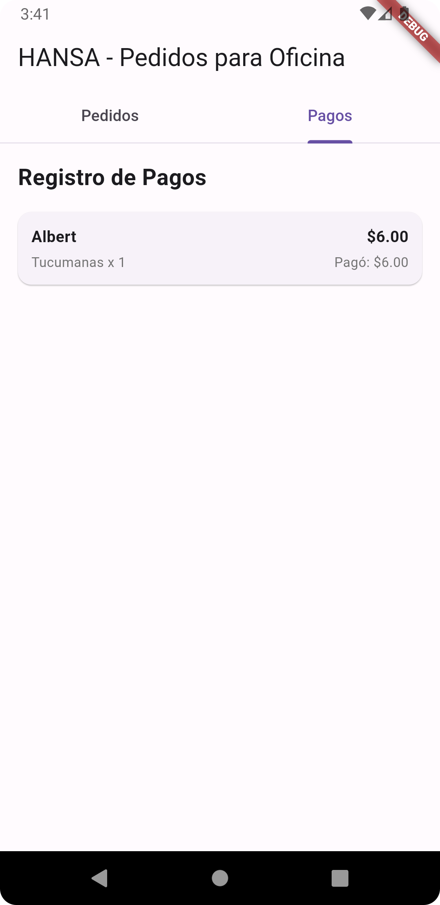
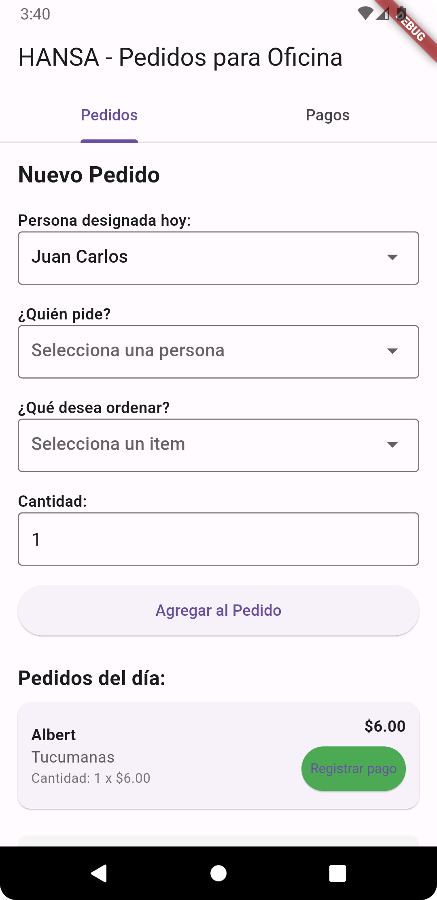
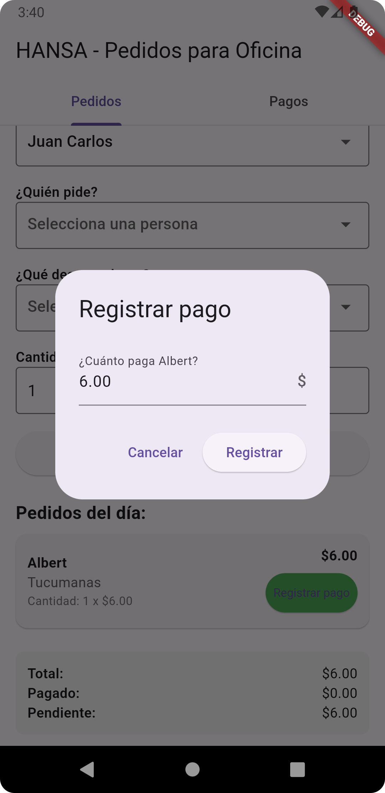
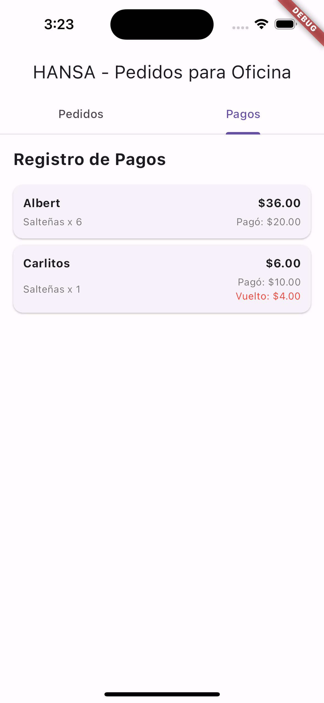
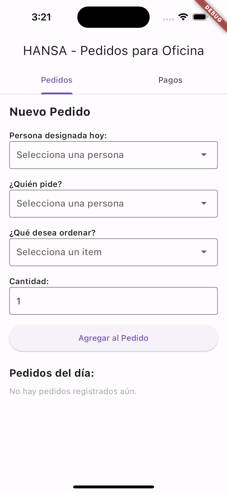
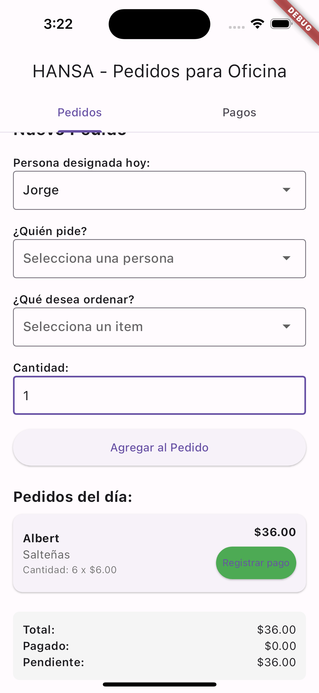
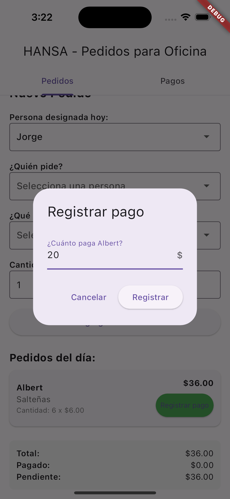

# Office Order App

A Flutter application designed to manage food orders for office settings. The app allows users to track orders, designate a person responsible for ordering, record payments, and manage the entire food ordering process for a team.

## Features

- **Order Management**: Create and track food orders for different team members
- **Designated Person**: Assign a team member responsible for collecting orders on a given day
- **Payment Tracking**: Record payments with support for exact and over-payment (with change calculation)
- **Financial Summary**: View total orders, paid amounts, and pending payments
- **User Interface**: Clean, tab-based interface separating active orders and payment history

## Screenshots

<div align="center">
  <div style="display: flex; flex-wrap: wrap; gap: 20px; justify-content: center;">
    
    
    
    
    
    
    

  </div>
</div>

## Getting Started

### Prerequisites

- [Flutter](https://flutter.dev/docs/get-started/install) (Latest stable version)
- Dart SDK
- Android Studio, VS Code, or any preferred IDE with Flutter plugins

### Installation

1. Clone the repository:
```bash
git clone https://github.com/your-username/office_order_app.git
```

2. Navigate to project directory:
```bash
cd office_order_app
```

3. Install dependencies:
```bash
flutter pub get
```

4. Run the app:
```bash
flutter run
```

## Usage

1. **Create an Order**:
   - Select the designated person for the day
   - Choose who is placing the order
   - Select the food item and quantity
   - Tap "Agregar al Pedido" (Add to Order)

2. **Record Payments**:
   - Find the order in the list
   - Tap "Registrar pago" (Record payment)
   - Enter the amount paid
   - The app will automatically calculate change if necessary

3. **View Payment History**:
   - Navigate to the "Pagos" (Payments) tab
   - View all completed payments with details

## Project Structure

- main.dart: Main application file containing all the code
- Data models:
  - `User`: Represents team members
  - `MenuItem`: Represents available food items
  - `Order`: Represents an order with payment status
  - `Payment`: Represents payment records

## Customization

To customize the app for your office:

1. Modify the `users` list in the `_HomeScreenState` class to add your team members
2. Update the `menuItems` list to include the food items available in your area
3. Adjust prices and other parameters as needed

## Future Improvements

- Data persistence (local storage or cloud backend)
- User authentication
- Multiple language support
- Order history by date
- Export reports as CSV/PDF

## License

This project is licensed under the MIT License - see the LICENSE file for details.

## Acknowledgements

- Flutter team for the excellent framework
- All contributors to this project
